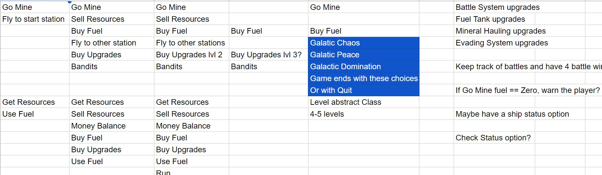
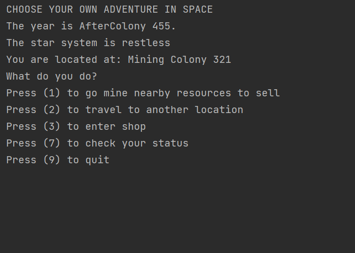
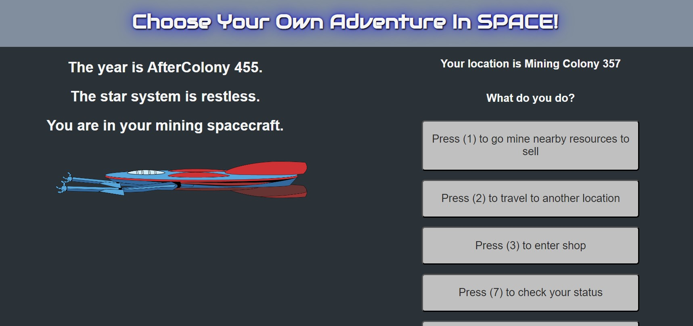
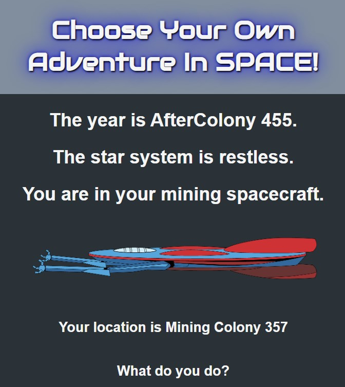

# Choose Your Own Adventure In Space :
    

### Table of Contents: 
    How I got started
    The game application and how it operates
    Connecting to a better User Interface
    TODO List

## How I got started 

This interactive game is a project I started as a way to explore what I was learning. While learning how to design and build Java applications 
1. I started to think about what would interest me and how I would go about that.   
2. Reading fiction books has always interested me and so has video games. 
3. I thought it would be fun to make a "choose your own adventure" game. 
4. I started to think about the backdrop, chose space, and went about figuring out  the choices for the user. 

## The game application and how it operates

1. I wanted to practice what I had been learning in Java, and moving data around an application was one of the goals.
2. Another goal was to encapsulate the data and the business logic, which I seperated from the client by adding a seperation class, the application. 
3. I knew I wanted different places the player could travel to. To make this, I created a Location class that said how to create a Location object.
4. I tried to come up with an easy way to chart where the player was as they traveled around. I eventually made a seperate class dedicated to being able to say the current location. I did this by using a map and matching the user choice with the cooresponding key value pair, returning the value. 
5. Getting the application to run end to end was the next step to make sure the pieces fit together before adding anymore complexity. I had the User Interface, Application, Spaceship, Location and Starchart classes built.
6. I checked to see that the user input was passing into the application. From there the user input got used by a method to send to the StarChart and retreive the correct location, which would then get pushed to the User Interface and printed to the console. 
7. After making sure it worked end to end, I started to add in more complexity, such as checking the fuel level of your spaceship when picking the choice of "Check your status"
8. This what the game looks like using the console.

## Connecting to a better User Interface

1. I knew I wanted a better looking User Interface than the console from the begining. 
2. As I started learning front-end development, I started to think about how this game could be played on a responsive website using the main Java application I had already built. 
3. I have begun to style the website for this game to be played, as seen below. 

## TODO List
1. There are a number of things I'd like to continue working on in my spare time. 
2. The biggest item as of writing this, is connecting the JavaScript to the Java application, which I will be learning about soon. 
3. Connecting Spring Boot to the Java side in order to accept the webservices. 
4. Completing some of the logic on the back end to make the game have endings based on the choices given. 